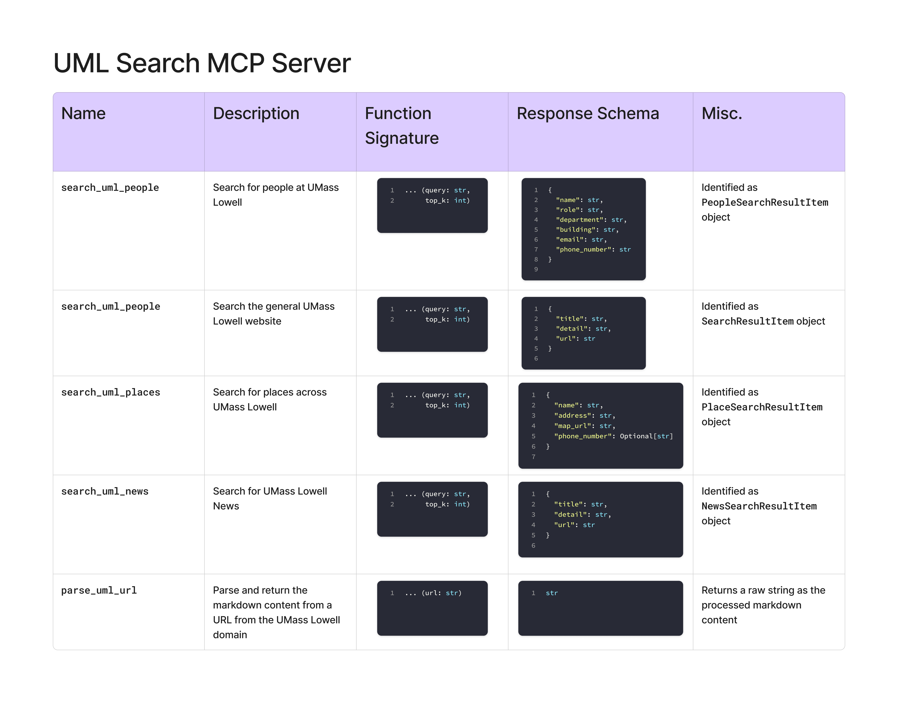

# UML Search MCP Server

An MCP server for searching across the UMass Lowell web domain.

## Usage

The MCP server can be used locally by either

- Run as host process: `uv run server.py`
  - Accessible at `localhost:8000/mcp`
- Run as a docker container: `./build_and_run.sh`
  - Accessible at `0.0.0.0:8000/mcp` or `localhost:8000/mcp` locally

> [!NOTE]
> If you're using the MCP Inspector tool for local development, uml-search-mcp uses the Streamable HTTP transport, not STDIO or server-sent events (SSE).

## ☸ Kubernetes

For production deployments on kubernetes check the reference manifest, `k8s/k8s_prod.yaml`.

## 🧩 Technologies

- Docker
- MCP

## 🛠️ Tool Calls

